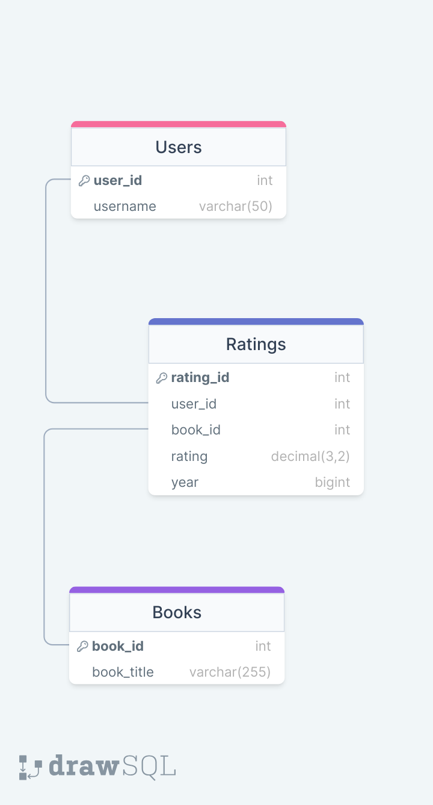

# Bookrate Telegram Bot

## Description
Bookrate is a Telegram bot designed to provide a simple interface for users to rate books. It utilizes SQLite3 powered by SQLAlchemy for data storage and aiogram3 for Telegram bot development.

## Features
- Allows users to rate books.
- Stores data in SQLite3 database.
- Utilizes aiogram3 for Telegram bot API calls.

## Data Storage
Data in Bookrate is stored as follows:
- Data Flow Diagram:
  
- Database Visualization:
  
